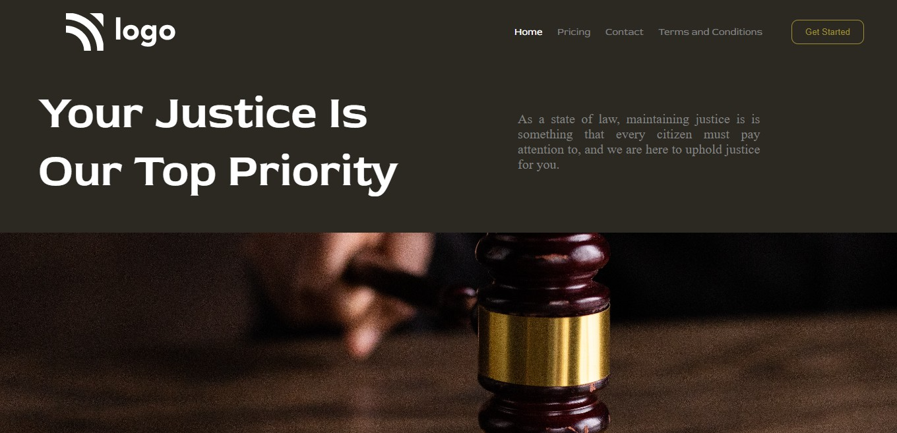

## ⭐Project 03- Law Home Page ⭐

 

## 📌 Live Site URL: <a href="https://law-order.netlify.app/">**Visit Now**</a>

 

## 📌 Screenshot:

 

## 📌 What I Learned:

- ### Learned about object-fit property
- ### Learned about Flexbox properties
- ### Learned styling of buttons

 

## 📌 Time Taken To Complete This Project:

- ### It took me 2.5 hours to complete this project

 

## 📌 Social Links:

